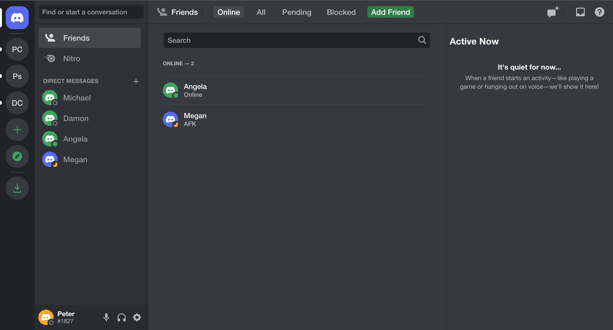

#  &nbsp; A Discord Clone

## Technologies

## Screenshots

## Table of Contents

- [About](#about)
- [Installation](#installation)
- [Features](#features)
- [Demo](#demo)
- [Links](#links)

## About

To be added...

## Installation

To be added...

## Features

To be added...

## Demo

To be added...

## Links

To be added...
